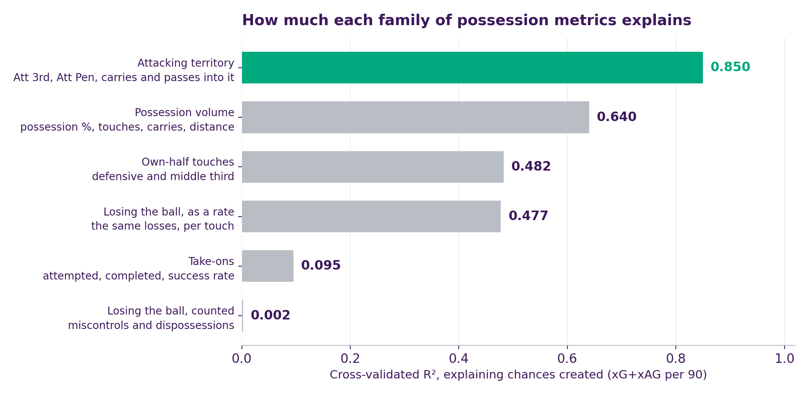
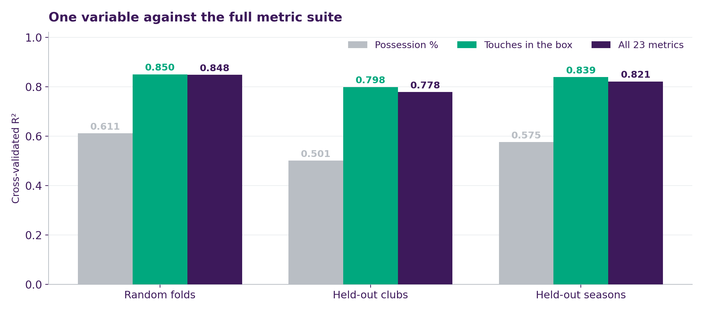
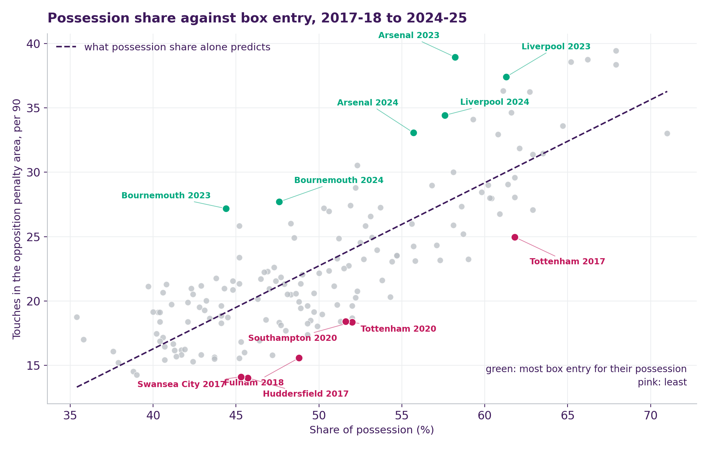
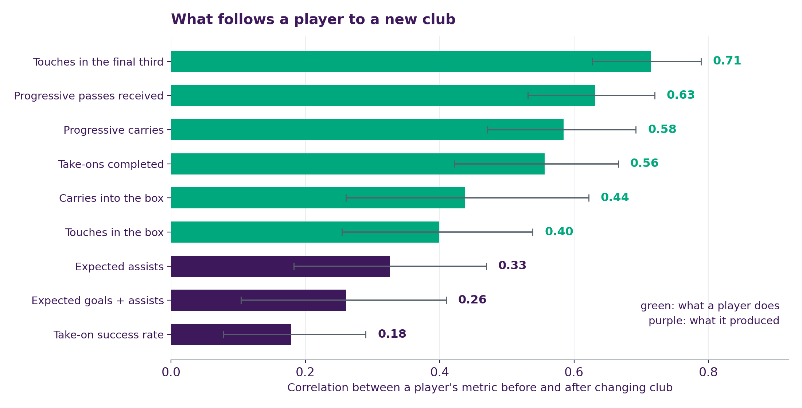
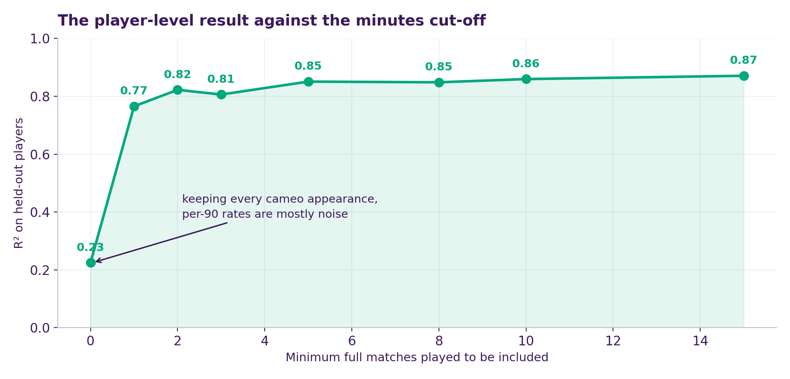

# Possession Doesn't Create Chances. Getting Into the Box Does.

> Eight Premier League seasons, asking whether the two dozen possession metrics clubs pay for are actually worth anything.

`Python` · `scikit-learn` · `statsmodels` · `grouped cross-validation`

## The question

Possession share is the number every broadcast puts on screen at half time. Data providers ship two dozen more alongside it: touches by pitch third, take-ons attempted and completed, carries, progressive distance, miscontrols.

Two things are worth knowing about all of that, and clubs care about them for different reasons:

1. **Which of these metrics tell you how good a team is at creating chances?**
2. **Which of them still describe a *player* after he moves to a different club?**

The data is 160 squad-seasons and 4,343 player-seasons from FBref, 2017–18 to 2024–25.

## Finding 1: one number does the work of all twenty-three

Group the metrics by what they actually measure, then test each group against how many chances a side creates (expected goals plus assists, per 90).



Where you have the ball matters far more than how much of it you have. **Attacking territory** — touches in the final third and the box, and the passes and carries that get you there — explains 85% of the variation between teams. **Possession volume**, the family containing possession share itself, manages 64%. **Take-ons**, the dribbling metrics that fill highlight reels, manage 9%.

Narrowing further: a single variable, **touches in the opposition penalty area**, scores **0.850 on its own**. All twenty-three metrics together score **0.848**.



Tested on clubs the model has never seen, the single variable holds at 0.798 while the full suite slips to 0.778. The other twenty-two don't just add nothing; they cost a little, most likely by fitting quirks of the training clubs.

A caveat worth stating: a touch in the opposition box is often a shot, so this is close to a mechanism rather than a surprise. The point isn't that box touches relate to chances. It's that an elaborate metric suite adds **nothing measurable** on top of one obvious number, and that possession share is a distinctly worse proxy for the same thing.

## Finding 2: some metrics aren't useless, they're just built wrong

Miscontrols and dispossessions score **0.002**, which reads like "losing the ball doesn't matter." It isn't. It's that *counting* losses compares two different things.

A side with 65% of the ball touches it roughly twice as often as one with 35%. Counting how often each loses it is like ranking drivers by number of scrapes without asking how far they drive.

Divide by touches and it inverts:

| | R² |
|---|---|
| Losses, counted | **0.002** |
| The same losses, per touch | **0.477** |

Manchester City in 2022–23 lost the ball **2.35 times per 100 touches**. Newcastle in 2021–22, **5.37**. More than twice as often.

**So should every metric be a rate?** No, and the pattern is intuitive once you see it. Dividing by touches helps four metrics and hurts fourteen:

- **Things you want less of** — losses, miscontrols, touches stuck in your own third — only mean something as a *rate*. The raw count mostly tracks how much you had the ball.
- **Things you want more of** — box touches, final-third touches, progressive carries — are about *volume*. Reaching the box 39 times is good. Reaching it as a high fraction of very few touches is not the same achievement.

Two honest caveats on the loss rate. It correlates −0.83 with possession share, so it's substantially another view of the same thing. And once box entry is in the model, it adds only 0.007.

**What this data can't tell you is *where* the ball was lost.** Losing it in your own box and losing it in the opposition's are completely different events. FBref reports losses as season totals with no location attached, though touches *are* zone-split. That's the first thing I'd add.

## Finding 3: some sides hold the ball and never arrive

Possession predicts box entry, but only loosely about two thirds of it. The leftover third is where clubs genuinely differ.



Take Fulham in 2018–19. They had 48.8% of the ball, and a side with that much possession normally reaches the opposition box about **22 times** a match. Fulham reached it **15.6** times. They were getting the ball but cannot reach the box that effectively.

Call that shortfall the **box-entry gap**. It's a persistent trait rather than a one-season blip: 45% of the variation in it is a club characteristic, and a club's gap correlates **r = 0.69** with its own gap the following season.

- **Tottenham** own four of the eight most sterile squad-seasons, running consecutively from 2017–18 to 2020–21. The 2017–18 side had 61.8% of the ball and reached the box less often than teams with eight points less possession.
- **Bournemouth** sit at the other end. In 2023–24 they had just 44.4% of the ball and still got into the box more often than that Tottenham side.

Tottenham are also the best evidence this tracks how a team plays rather than labelling it forever. Their gap runs −5.4, −5.3, −5.3, −5.3 across those four seasons, then −1.2, −0.6, **+4.4**, +1.9. It moved when the approach did.

## Finding 4: what actually follows a player to a new club

Everything above is about teams. A club signing a player is making a different bet: that a number measured at his old club still means something at yours.

That's testable. **168 of these player-seasons are players who changed Premier League club** between consecutive seasons, so you can compare them before and after the move. Each is measured against his **same-position teammates**, so moving from a weak squad to a strong one doesn't get mistaken for the player improving.



**What a player does travels. What it produced does not.**

Touches in the final third carry across a move at **r = 0.71**. Progressive passes received, 0.63. Expected goals plus assists carries at **0.26**.

Take-on success rate finishes last at 0.18, closing a loop with Finding 1: dribbling explained the least about chance creation, and it's also the least repeatable thing a player carries.

**This cuts against Finding 1, and the tension is the interesting part.** Box touches is the best description of how many chances a *team* creates, and one of the weaker things to sign a *player* on (0.40). Both are true, because how often a player touches the ball in the box depends heavily on the structure built around him. Team questions and player questions need different metrics.

## What I'd do next

1. **Losses by pitch zone.** The biggest gap. Losing the ball in your own third and in the opposition box are different events and only one hurts. Needs event-level data (StatsBomb, Opta) where every loss carries coordinates. My guess is a defensive-third loss rate would predict goals *conceded* far better than the aggregate rate predicts anything.
2. **Possession under pressure.** Keeping the ball against a high press is a different skill from keeping it unopposed, and the aggregate blends them.
3. **Transfers from outside the Premier League.** All 168 moves here are within the league. Arrivals from the Eredivisie or Ligue 1 are exactly where a "does this number travel?" test matters most, and exactly what this sample can't see.
4. **Opponent adjustment.** These are season aggregates. A side that piles up box entries against weak opponents looks identical to one that spreads them evenly.
5. **Split creating from finishing.** xG+xAG merges a player's own shooting with the chances he makes for others. The transfer result already hints they behave differently.

A caution on all of it: none of this is causal. Telling a squad to take more touches in the box isn't a tactic, it's a restatement of the objective. What this supports is a **measurement** that box entry is worth tracking, but not a prescription for how to get there.

<details>
<summary><b>Data, method, and one number that depends entirely on a preprocessing choice</b></summary>

FBref squad and player possession and standard-stats tables, Premier League 2017–18 to 2024–25: 160 squad-seasons across 31 clubs, 4,343 player-seasons. All figures are per-90. The target is xG+xAG per 90, so the xG and xAG components are excluded from the predictors.

Squad models are linear regressions on standardized features, scored by cross-validated R². The same club recurs in up to eight seasons and playing style persists, so random folds leak club identity between train and test; `GroupKFold` on club and separately on season are reported alongside. Metric families were grouped by what they measure before testing, not selected by performance.

The box-entry gap is the residual from regressing penalty-area touches on possession share. Adding it to a possession-only model lifts R² from 0.631 to 0.863, but that is an exact reparameterisation of adding box touches — possession plus the gap contains the same information as possession plus box touches, and both return 0.863. It is presented as a way of *separating how much ball you have from what you do with it*, not as independent explanatory power. The script prints both models so this is explicit.

The transfer analysis takes players with at least five full matches in consecutive seasons who changed club between them. Each player-season is expressed relative to same-position teammates at that club, so squad strength and role are differenced out. Correlations carry bootstrap intervals from 3,000 resamples. Only intra-league moves are observable.

**The minutes threshold.** Running the player-level model on everyone gives R² = 0.225. Requiring one full match of minutes gives **0.765**; five matches, **0.851**. The reason is that 483 players logged under one full match, and their per-90 rates run as high as 9.7 against a league average of 0.22 — a substitute who touches the ball twice and wins a penalty is a rounding error with a tiny denominator. The original report states R² = 0.364 with no threshold given, which sits between the first two. Any single number here is a statement about the filter as much as about possession, which is why the curve is reported rather than a point.



**Limits.** One league, and for the transfer test only moves within it. xG+xAG is a model output, not ground truth. Everything is a season aggregate, so nothing separates a side that concentrates box entries against weak opponents from one that spreads them evenly. The metric rankings are claims about *these* metrics against *this* target on 160 squad-seasons; a larger sample or a different target could rank them differently.

</details>

## Where this started

A cross-validation study of how possession metrics relate to offensive output. Its methodology is what made going further possible, which is setting the target, assembling the eight seasons, and validating properly rather than reporting a single fit. However, it left two threads hanging, and both became sections above: the player-level R² was reported without a minutes threshold, and the squad work established that possession metrics predict output without asking *which ones*, or whether the full suite beats the obvious single variable. The original report is in `original-project/`.

## Running it

```bash
pip install -r requirements.txt
python3 possession_analysis.py
```
